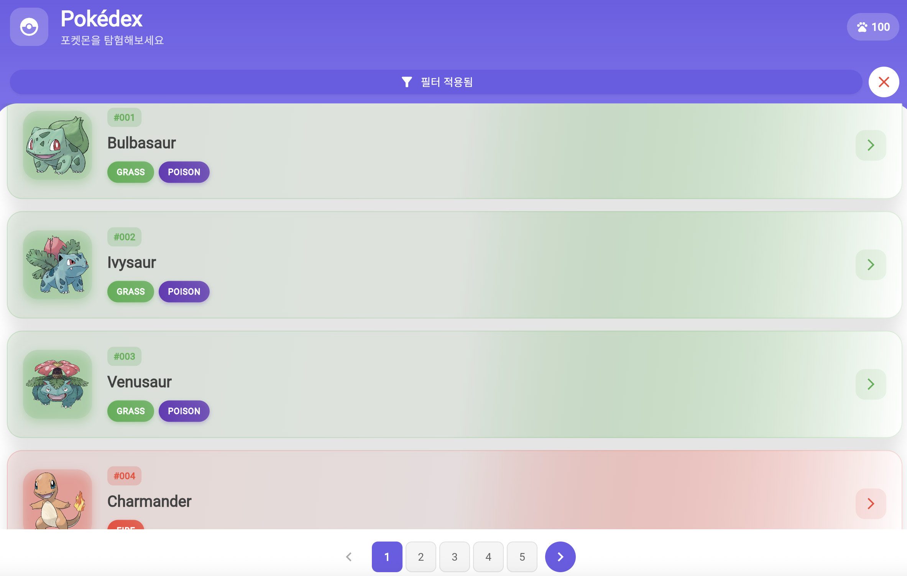
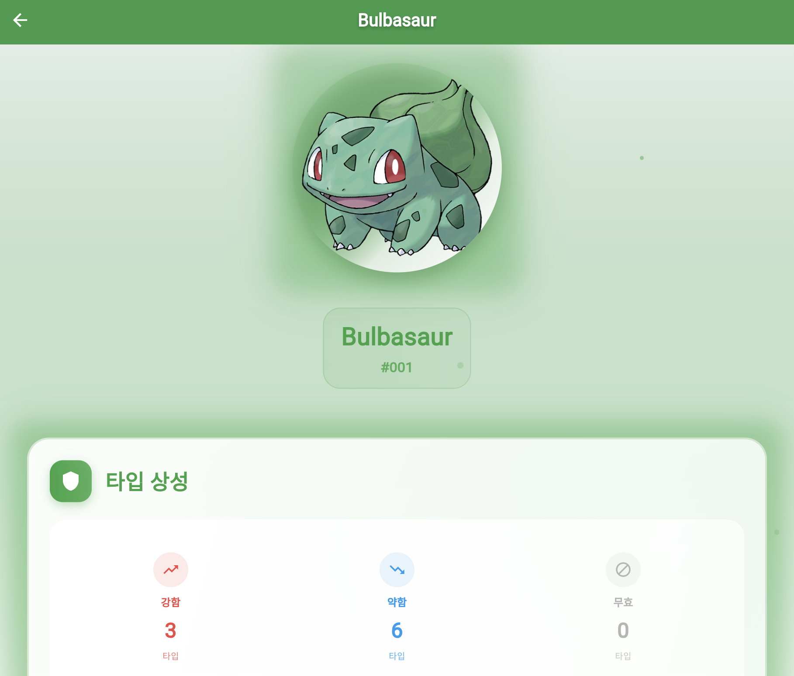

# Pokédex - Flutter Study Project

포켓몬 조회 앱을 통한 Flutter 학습 프로젝트입니다.

## 🎯 프로젝트 개요

이 프로젝트는 Flutter 학습을 위해 만든 포켓몬 조회 앱(Pokédex)입니다. 실제 Pokemon API를 사용하여 포켓몬 정보를 조회하고 표시하는 기능을 구현했습니다.

## ✨ 주요 기능

- **포켓몬 리스트 조회**: 포켓몬 목록을 페이지네이션으로 조회
- **포켓몬 상세 정보**: 각 포켓몬의 상세 정보 확인
- **타입별 색상 구분**: 포켓몬 타입에 따른 색상 표시
- **능력치 시각화**: 포켓몬의 능력치를 프로그레스 바로 표시
- **반응형 UI**: 다양한 화면 크기에 대응하는 UI

## 🛠 기술 스택

- **Flutter**: 크로스 플랫폼 모바일 앱 개발 프레임워크
- **Dart**: 프로그래밍 언어
- **HTTP**: API 통신을 위한 패키지
- **JSON Serialization**: 데이터 직렬화/역직렬화
- **Material Design 3**: 최신 Material Design 적용

## 📱 화면 구성

### 1. 포켓몬 리스트 화면
- 포켓몬 목록을 카드 형태로 표시
- 포켓몬 이미지, 이름, 번호, 타입 정보 표시
- 무한 스크롤을 통한 페이지네이션
- Pull-to-refresh 기능

### 2. 포켓몬 상세 화면
- 포켓몬의 고해상도 이미지 표시
- 기본 정보 (키, 무게, 타입)
- 능력치를 프로그레스 바로 시각화
- 특성 정보 표시

## 🚀 실행 방법

### 방법 1: 자동 빌드 스크립트 사용
```bash
# 빌드 스크립트 실행 (권장)
./build.sh
```

### 방법 2: 수동 실행
1. Flutter SDK 설치
2. 프로젝트 의존성 설치:
   ```bash
   flutter pub get
   ```
3. 코드 생성:
   ```bash
   flutter packages pub run build_runner build --delete-conflicting-outputs
   ```
4. 앱 실행:
   ```bash
   flutter run
   ```

### 방법 3: 특정 플랫폼 빌드
```bash
# Android APK 빌드
flutter build apk --release

# iOS 빌드 (macOS만)
flutter build ios --release --no-codesign

# Web 빌드
flutter build web --release
```

## 📁 프로젝트 구조

```
lib/
├── main.dart                    # 앱 진입점
├── models/
│   ├── pokemon.dart            # 포켓몬 데이터 모델
│   └── pokemon.g.dart          # JSON 직렬화 코드
├── services/
│   └── pokemon_api_service.dart # Pokemon API 서비스
├── screens/
│   ├── pokemon_list_screen.dart  # 포켓몬 리스트 화면
│   └── pokemon_detail_screen.dart # 포켓몬 상세 화면
├── utils/
│   └── pokemon_utils.dart      # 유틸리티 함수들
└── widgets/
    ├── common_widgets.dart     # 공통 위젯들
    └── pokemon_widgets.dart    # 포켓몬 전용 위젯들
```

## 📱 스크린샷
  
  
---

## 🔧 주요 패키지

- `http: ^1.2.2` - HTTP 요청 처리
- `json_annotation: ^4.9.0` - JSON 직렬화 어노테이션
- `json_serializable: ^6.8.0` - JSON 직렬화 코드 생성
- `build_runner: ^2.4.13` - 코드 생성 도구

## 📚 학습 포인트

이 프로젝트를 통해 다음 Flutter 개념들을 학습할 수 있습니다:

- **StatefulWidget과 StatelessWidget** 사용법
- **HTTP API 통신** 및 비동기 처리
- **JSON 데이터 모델링** 및 직렬화
- **ListView와 GridView** 사용법
- **네비게이션** 및 화면 전환
- **Material Design 3** 적용
- **반응형 UI** 구현
- **에러 처리** 및 로딩 상태 관리

## 🌟 특징

- **2025년 최신 코드**: 최신 Flutter 및 Dart 문법 사용
- **Material Design 3**: 최신 디자인 시스템 적용
- **타입 안전성**: 강타입 언어의 장점 활용
- **에러 처리**: 네트워크 오류 및 예외 상황 처리
- **성능 최적화**: 이미지 캐싱 및 효율적인 리스트 렌더링
- **모듈화된 구조**: 재사용 가능한 위젯과 유틸리티
- **자동 빌드**: 빌드 스크립트로 간편한 배포
- **크로스 플랫폼**: Android, iOS, Web 지원

## 🛠 추가 도구

- **빌드 스크립트**: `build.sh` - 자동 빌드 및 배포
- **빌드 설정**: `build_config.yaml` - 빌드 환경 설정
- **공통 위젯**: 재사용 가능한 UI 컴포넌트
- **유틸리티**: 포켓몬 관련 헬퍼 함수들

## 📄 라이선스

이 프로젝트는 학습 목적으로 제작되었습니다.

## Getting Started

This project is a starting point for a Flutter application.

A few resources to get you started if this is your first Flutter project:

- [Lab: Write your first Flutter app](https://docs.flutter.dev/get-started/codelab)
- [Cookbook: Useful Flutter samples](https://docs.flutter.dev/cookbook)

For help getting started with Flutter development, view the
[online documentation](https://docs.flutter.dev/), which offers tutorials,
samples, guidance on mobile development, and a full API reference.
